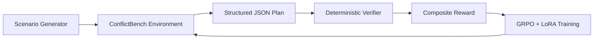

<div align="center">

# Harsh Jain

### Applied ML & AI Engineer building intelligent systems that learn, reason, and ship


<p>
  <a href="https://github.com/Harsh-4210"></a>
  <a href="https://www.linkedin.com/in/harsh-jain0621/"></a>
  <a href="mailto:harshjain0621@gmail.com"></a>
</p>

<p>
  
</p>

</div>

---

<div align="center">

**[Flagship Project](#flagship-project)** &nbsp; `·` &nbsp;
**[Selected Work](#selected-work)** &nbsp; `·` &nbsp;
**[Technical Stack](#technical-stack)** &nbsp; `·` &nbsp;
**[GitHub Activity](#github-activity)**

</div>

<br />

<table>
<tr>
<td width="50%" valign="top">

### Now building

Reliable AI systems with explicit evaluation, adversarial testing, structured outputs, and deployment paths that survive real users.

</td>
<td width="50%" valign="top">

### Best fit

Applied ML engineering, reinforcement learning, LLM evaluation, agentic systems, and research-heavy product teams.

</td>
</tr>
</table>

---

## About Me

I am an Artificial Intelligence and Data Science student at Savitribai Phule Pune University, focused on turning research ideas into measurable, deployable systems.

My work sits at the intersection of:

- **Reinforcement learning:** GRPO, PPO, reward design, environments, and agent evaluation
- **LLM systems:** fine-tuning, LoRA/QLoRA, RAG, structured generation, and agentic workflows
- **Applied ML:** computer vision, emissions prediction, feature engineering, and optimization
- **Production engineering:** FastAPI services, React applications, Docker, databases, and CI/CD

I care about systems that are not only impressive in a demo, but also observable, testable, and honest about their limitations.

```text
Currently studying:  B.E. Artificial Intelligence & Data Science | GPA: 8.75/10
Based in:           Pune, India
Open to:            ML engineering, applied AI, RL, and research-oriented collaborations
Contact:            harshjain0621@gmail.com
```

<details>
<summary><b>My engineering lens</b></summary>
<br />

| Question | My default answer |
|---|---|
| How should an AI system improve? | Through a measurable reward, evaluation set, or feedback signal. |
| How should it fail? | Explicitly, with structured outputs, logs, and recoverable state. |
| How should it ship? | Behind a clear API, reproducible environment, and a testable workflow. |
| What do I distrust? | Impressive demos without baselines, error analysis, or deployment evidence. |

</details>

---

## Project Index

| Project | Core question | Stack | Status |
|---|---|---|---|
| **ConflictBench** | Can an LLM learn authority resolution from reward alone? | GRPO, QLoRA, Qwen2.5-3B | Featured |
| **Inquisitor / ARMS RACE V3** | Can one agent expose another agent's confident mistakes? | PPO, LoRA, structured RL | Research system |
| **TraceLink** | Can quality teams trace a defect across the factory graph? | FastAPI, React, SQLite, Docker | Deployed system |
| **Arivon** | Can learning adapt to the gap between confidence and competence? | Next.js, FastAPI, RAG | Team platform |
| **InsureClear** | Can policy evidence become a reviewable insurance appeal? | Gemini, agents, FastAPI, React | Working demo |
| **SO2 Prediction** | Can emissions forecasting become a reproducible service? | XGBoost, Optuna, Docker | Completed system |

<div align="center">

<sub>Each project explores a different failure mode: conflicting instructions, hallucinations, broken traceability, miscalibrated learning, opaque denials, or unreliable predictions.</sub>

</div>

---

## Flagship Project

<table>
<tr>
<td width="100%">

### ConflictBench

**A reinforcement-learning environment that teaches language models to resolve contradictory business instructions.**

ConflictBench trains a Qwen2.5-3B model with GRPO and LoRA to infer an implicit six-tier authority hierarchy from reward signals alone:

`Legal > C-Suite > VP > Director > Team Lead > Individual Contributor`

The hierarchy is never stated in the prompt. The agent must identify conflicts, produce a valid execution plan, override lower-priority instructions, and remain consistent across scenarios containing 8-28 directives and 2-6 embedded conflict pairs.

**What makes it interesting:**

- Deterministic five-part reward with no LLM judge
- Scores final-state correctness, contradiction freedom, conflict-pair F1, efficiency, and JSON compliance
- Trained on 400 scenarios for 2 epochs on an A100 48 GB
- Composite reward improved from **0.14 to 0.50**, a **257% improvement** over zero-shot baseline
- Published LoRA adapter and browser-runnable baseline-versus-fine-tuned demo

<p>
  <a href="https://github.com/Harsh-4210/Conflict_Bench"></a>
  <a href="https://huggingface.co/spaces/Harsh-9209/Conflict_Bench"></a>
  <a href="https://huggingface.co/Harsh-9209/conflictbench-qwen2.5-3b-grpo-lora"></a>
</p>

</td>
</tr>
</table>

<details>
<summary><b>ConflictBench architecture</b></summary>
<br />



  <br />

  <table>
  <tr>
  <td><b>Input</b><br />Contradictory directives</td>
  <td><b>Reasoning</b><br />Conflict detection + authority inference</td>
  <td><b>Output</b><br />Executable JSON plan</td>
  <td><b>Learning</b><br />Deterministic reward + GRPO</td>
  </tr>
  </table>

</details>

  <details>
  <summary><b>Why the result matters</b></summary>
  <br />

  The interesting part is not just fine-tuning a model. It is making the evaluation signal precise enough that the model must learn a hidden operational rule instead of copying a phrase from the prompt. The verifier makes every decision inspectable: which conflicts were identified, which instruction won, whether the final plan is internally consistent, and whether the output obeys the schema.

  </details>

---

## Selected Work

### Inquisitor / ARMS RACE V3 - Adversarial Oversight Arena

A two-agent red/blue system for detecting silent-failure hallucinations. The Red Agent generates semantically plausible wrong answers while the Blue Agent returns structured `Pass`, `Flag`, or `Probe` decisions.

- Designed Expert Correction Training to turn failed RL steps into supervised learning signal
- Used asymmetric rewards so flagging every answer is not a profitable strategy
- Added zero-sum ELO tracking to prevent both agents from co-declining
- Detection improved from **25% to 100%**, with a **4% false-alarm rate** and **96% out-of-distribution generalisation**

<details>
<summary><b>System loop</b></summary>
<br />

`Question -> Red response -> Blue Pass/Flag/Probe -> asymmetric reward -> correction or update`

</details>

### TraceLink

A production-deployed manufacturing traceability platform for tracing dispatch orders backward through production batches, QC inspections, and raw-material lots, then forward from a flagged lot to affected customer orders.

- Six-entity traceability graph with forward, reverse, and blast-radius investigation
- Six-role RBAC with Firebase ID-token verification
- CSV ingestion with rollback support and request-level audit trails
- Natural-language AI query endpoint for quality teams
- Dockerised FastAPI and React deployment with OpenAPI documentation

<a href="https://github.com/ruxir-ig/mccia-tracelink">View TraceLink</a>

### Arivon

An adaptive learning platform that detects when a student's confidence diverges from actual performance and adjusts the learning path accordingly.

- Bloom's taxonomy-based difficulty adjustment
- React Flow knowledge graph for concept relationships
- Voice exam interface with Groq Whisper
- Haystack RAG study mentor
- PostgreSQL, MongoDB, and Redis-backed session and cache architecture

<a href="https://github.com/nishtha911/Pragyantra-ED14-ET-3">View Arivon</a>

### InsureClear

A multi-agent Indian health-insurance appeal generator that analyzes denial letters and policy documents, checks IRDAI-grounded reasoning, drafts an appeal, and uses a judge loop for quality review.

- Auditor, policy analyst, IRDAI checker, appeal writer, and judge agents
- PDF, text, CLI, Streamlit, FastAPI, and React workflows
- Checkpointed case execution with downloadable appeal letters and reports

<a href="https://github.com/Harsh-4210/insureclear">View InsureClear</a>

### SO2 Emission Prediction System

An end-to-end ML pipeline for predicting SO2 emissions from Indian coal power plants.

- XGBoost with feature selection and cross-validation
- Optuna hyperparameter tuning
- 85% accuracy on held-out test data
- Containerised FastAPI deployment with Docker

<details>
<summary><b>What I learned across these systems</b></summary>
<br />

The recurring engineering challenge is the same across domains: define what "correct" means before asking a model to optimize for it. In ConflictBench that became a deterministic verifier; in oversight it became asymmetric risk-sensitive rewards; in TraceLink it became auditable state transitions; and in InsureClear it became a judge threshold plus revision loop.

</details>

---

## Experience

**Machine Learning Intern, Prodigy InfoTech** | Mumbai | Nov 2025 - Jan 2026

- Delivered five end-to-end ML projects across supervised learning, unsupervised learning, and computer vision
- Built pipelines from preprocessing and feature engineering through training, tuning, and evaluation
- Worked with Python, Scikit-learn, TensorFlow, and Keras
- Received a Letter of Recommendation from the Software Engineering Manager

---

## Technical Stack

<table>
<tr>
<td valign="top" width="33%">

### ML & AI


</td>
<td valign="top" width="33%">

### Backend & Data


</td>
<td valign="top" width="33%">

### Engineering


</td>
</tr>
</table>

Also: TensorFlow, Keras, Scikit-learn, TRL, Unsloth, PEFT, Ray RLlib, OpenCV, YOLOv8, ONNX Runtime, Albumentations, LangGraph, Docker Compose, PostgreSQL, MongoDB, Redis, and CI/CD.

---

## By The Numbers

<div align="center">

| 257% | 100% | 85% | 8.75/10 |
|:---:|:---:|:---:|:---:|
| ConflictBench reward improvement | Silent-failure detection | SO2 held-out accuracy | University GPA |

</div>

---

## Recognition

- **Top 100 Finalist** - Meta x PyTorch x Hugging Face OpenEnv Hackathon, ConflictBench
- **3rd Place** - Pragyantra, PES Modern College of Engineering, Arivon

---

## GitHub Activity

<div align="center">

<a href="https://github.com/Harsh-4210">
  
</a>
<a href="https://github.com/Harsh-4210">
  
</a>

<br />


</div>

---

## What I Am Building Toward

Reliable AI systems that combine strong learning signals with strong engineering fundamentals: explicit evaluation, adversarial testing, structured outputs, traceable decisions, and deployment paths that survive contact with real users.

<div align="center">

### Let us build something useful.

<a href="mailto:harshjain0621@gmail.com">Email me</a> &nbsp; | &nbsp;
<a href="https://www.linkedin.com/in/harsh-jain0621/">Connect on LinkedIn</a> &nbsp; | &nbsp;
<a href="https://github.com/Harsh-4210">Explore my repositories</a>

</div>
