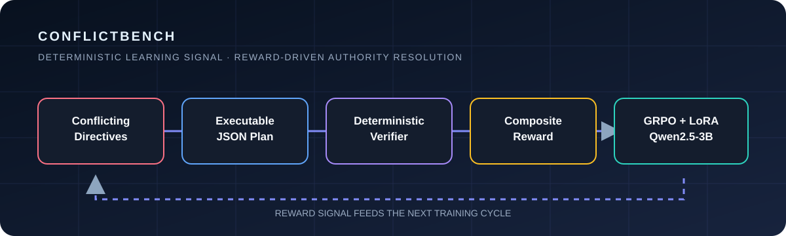
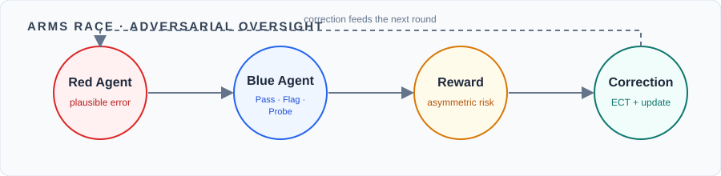
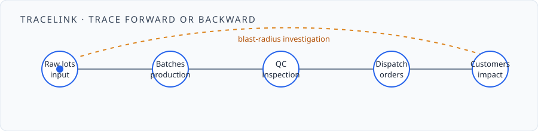

 

 

🎓 B.E. Artificial Intelligence &amp; Data Science @ SPPU &nbsp;•&nbsp; GPA 8.75/10 &nbsp;•&nbsp; Pune, India

---

<a href="#-about-me">About</a> &nbsp;·&nbsp;
<a href="#-live-github-stats">📊 Stats</a> &nbsp;·&nbsp;
<a href="#-github-trophies">🏆 Trophies</a> &nbsp;·&nbsp;
<a href="#-flagship-project">🚀 Flagship</a> &nbsp;·&nbsp;
<a href="#-selected-work">💼 Work</a> &nbsp;·&nbsp;
<a href="#%EF%B8%8F-technical-stack">⚙️ Stack</a> &nbsp;·&nbsp;
<a href="#-contribution-snake">🐍 Snake</a>

 

---

## 🧩 About Me

<table>
<tr>
<td width="33%" valign="top">

### ◉ Currently focused

Reliable AI with explicit evaluation, adversarial testing, and structured outputs.

</td>
<td width="33%" valign="top">

### ↗ Best fit

ML engineering, applied AI, reinforcement learning, LLM systems, and research-oriented collaborations.

</td>
<td width="33%" valign="top">

### ✦ North star

Systems that are useful beyond the demo: observable, testable, and ready to ship.

</td>
</tr>
</table>

I turn research ideas into measurable, deployable systems — at the intersection of reinforcement learning, LLM systems, applied ML, and production engineering.

- **Reinforcement learning:** GRPO, PPO, reward design, environments, and agent evaluation
- **LLM systems:** fine-tuning, LoRA/QLoRA, RAG, structured generation, and agentic workflows
- **Applied ML:** computer vision, emissions prediction, feature engineering, and optimization
- **Production engineering:** FastAPI services, React applications, Docker, databases, and CI/CD

> **My approach:** design the evaluation first, make decisions traceable, and treat deployment as part of the research — not the final polish.

---

## 📊 Live GitHub Stats

&nbsp;

 

---

## 🏆 GitHub Trophies

---

## 📈 Contribution Activity

---

## 🚀 Flagship Project

### ConflictBench &nbsp;·&nbsp; *Reward-driven authority resolution*

**Can an LLM learn authority resolution from reward alone?**

ConflictBench is a reinforcement-learning environment that teaches language models to resolve contradictory business instructions. The model infers an implicit six-tier authority hierarchy from reward signals rather than being given the rule directly:

`Legal > C-Suite > VP > Director > Team Lead > Individual Contributor`

Scenarios contain 8–28 directives and 2–6 embedded conflict pairs. The agent must detect conflicts, produce an executable plan, override lower-priority instructions, and remain consistent in structured JSON.

| Signal | Evidence |
|---|---|
| **Composite reward** | **0.14 → 0.50** — a 257% improvement over zero-shot |
| Reward design | Deterministic correctness, contradiction freedom, conflict-pair F1, efficiency, and JSON compliance |
| Training | GRPO + LoRA on Qwen2.5-3B, 400 scenarios, 2 epochs, single A100 48 GB |
| Recognition | Top 100 finalist, Meta × PyTorch × Hugging Face OpenEnv Hackathon |

---

## 💼 Selected Work

A selection of systems spanning adversarial LLM evaluation, production traceability, adaptive learning, and applied forecasting.

### 01 — [Inquisitor / ARMS RACE V3](https://github.com/Harsh-4210/LLM_HALLUCINATION_RL)

A two-agent red/blue system for detecting silent-failure hallucinations. The Red Agent generates semantically plausible wrong answers while the Blue Agent returns structured `Pass`, `Flag`, or `Probe` decisions.

- Expert Correction Training turns failed RL steps into supervised learning signal
- Detection improved from **25% to 100%**, with a **4% false-alarm rate**
- **96% out-of-distribution generalisation** across unseen domains
- Asymmetric rewards and zero-sum ELO tracking discourage indiscriminate flagging

`PPO` &nbsp; `LoRA` &nbsp; `PEFT` &nbsp; `REINFORCE` &nbsp; `SFT`

### 02 — [TraceLink](https://github.com/ruxir-ig/mccia-tracelink)

A production-deployed manufacturing traceability platform for tracing dispatch orders backward through production batches, QC inspections, and raw-material lots, then forward from a flagged lot to affected customer orders.

- Six-entity traceability graph with forward, reverse, and blast-radius investigation
- Six-role RBAC with Firebase ID-token verification
- CSV ingestion with rollback support and request-level audit trails
- Natural-language AI query endpoint with Dockerised FastAPI and React deployment

`FastAPI` &nbsp; `React` &nbsp; `Firebase Auth` &nbsp; `SQLite` &nbsp; `Docker`

### 03 — [Arivon](https://github.com/nishtha911/Pragyantra-ED14-ET-3)

An adaptive learning platform that detects when confidence diverges from actual performance and adjusts the learning path accordingly.

- Bloom's taxonomy-based difficulty adjustment
- React Flow knowledge graph and voice exam interface with Groq Whisper
- Haystack RAG study mentor backed by PostgreSQL, MongoDB, and Redis
- **3rd Place — Pragyantra, PES Modern College of Engineering**

`Next.js` &nbsp; `FastAPI` &nbsp; `Haystack` &nbsp; `MongoDB` &nbsp; `Redis`

### 04 — [SO2 Emission Prediction](https://github.com/Harsh-4210/SO2-Emission-Prediction)

An end-to-end ML pipeline for predicting SO2 emissions from Indian coal power plants.

- XGBoost with feature selection, cross-validation, and Optuna tuning
- Containerised FastAPI deployment with structured error handling
- Reproducible data-to-inference workflow

`XGBoost` &nbsp; `FastAPI` &nbsp; `Optuna` &nbsp; `Docker`

---

## ⚙️ Technical Stack

**🧠 ML & AI**

`PyTorch` &nbsp; `Transformers` &nbsp; `GRPO` &nbsp; `PPO` &nbsp; `LoRA/QLoRA` &nbsp; `TRL` &nbsp; `Unsloth` &nbsp; `PEFT` &nbsp; `Ray RLlib` &nbsp; `RAG` &nbsp; `YOLOv8`

 

**⚙️ Backend & Data**

`FastAPI` &nbsp; `React` &nbsp; `Next.js` &nbsp; `PostgreSQL` &nbsp; `MongoDB` &nbsp; `Redis` &nbsp; `Firebase`

 

**🚀 Engineering & DevOps**

`Docker` &nbsp; `Docker Compose` &nbsp; `GitHub Actions` &nbsp; `GCP` &nbsp; `ONNX Runtime` &nbsp; `CI/CD` &nbsp; `OpenAPI`

---

## ✦ Recognition

| ✦ | Milestone | Context |
|---|---|---|
| **Top 100 Finalist** | Meta × PyTorch × Hugging Face OpenEnv Hackathon | ConflictBench |
| **3rd Place** | Pragyantra, PES Modern College of Engineering | Arivon |
| **ML Intern** | Prodigy InfoTech · Nov 2025–Jan 2026 | Applied machine learning |

---

## 🐍 Contribution Snake

<picture>
  <source media="(prefers-color-scheme: dark)" srcset="https://raw.githubusercontent.com/Harsh-4210/Harsh-4210/output/github-contribution-grid-snake-dark.svg" />
  <source media="(prefers-color-scheme: light)" srcset="https://raw.githubusercontent.com/Harsh-4210/Harsh-4210/output/github-contribution-grid-snake.svg" />
  
</picture>

---

### Building toward reliable AI

Explicit evaluation, adversarial testing, structured outputs, traceable decisions, and deployment paths that survive contact with real users.

 

 

